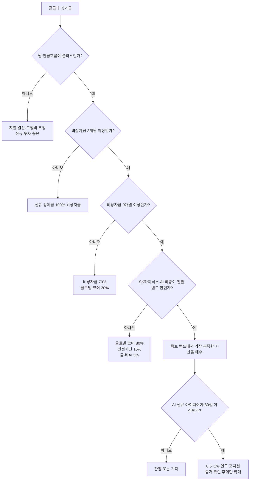

# Brian 투자 운영 플레이북 v1.1

작성일: 2026-07-19

상태: 검토 대기 중인 실행 초안

상세 정책: `life/finance/brian_investment_policy_202607.yaml`

계산 원장: `life/finance/brian_investment_policy_execution_202607.yaml`

## 한 문장 결론

AI 장기 전망은 유지하되, 지금은 AI를 더 사지 않고 월 현금흐름과 비상자금을 복구하면서 글로벌 코어를 만든다. 기존 집중 포지션은 성급하게 전량 매도하지 않고 신규자금 희석, 세금 검토, 단계적 감축을 조합한다.

## 현재 포트폴리오가 말하는 것

- 확인된 주식·ETF·금: 123,448,709원
- SK하이닉스 직접주식: 68,345,998원, 55.36%
- 명시적 AI·데이터센터 관련 1차 분류: 112,099,369원, 최소 90.81%
- 상품 수: 17개
- 글로벌 광범위 주식 코어로 분류할 수 있는 상품: 현재 확인되지 않음
- 눈에 보이는 비AI 분산자산: 금 0.62%

상품은 여러 개지만 직접 SK하이닉스, HBM, 미국 반도체, 엔비디아 가치사슬, AI 액티브 ETF가 같은 기업과 같은 설비투자 사이클을 반복할 가능성이 높다. KODEX 200도 삼성전자·SK하이닉스와 한국 경기 노출을 포함하므로 글로벌 코어로 계산하지 않는다.

FINRA도 고용주 주식, 같은 산업의 여러 펀드, 개별주식과 ETF의 중첩을 함께 보라고 안내한다. 고용주가 어려워질 때 일자리와 투자자산이 동시에 영향을 받을 수 있고, 일부 전문가가 단일주식 10%를 상한으로 제시하지만 개인 상황에 따라 그보다 낮아야 할 수 있다고 설명한다.

## 돈이 흐르는 순서



## 목적지 자산배분

비상자금과 3년 안에 쓸 돈을 제외한 장기 투자자산 기준이다.

| 역할 | 목표 | 허용 밴드 |
|---|---:|---:|
| 저비용 글로벌 주식 코어 | 55% | 50~60% |
| 현금성·단기 안전자산 | 15% | 10~20% |
| 명시적 AI 인프라 위성 | 20% | 15~25% |
| 금·실물자산 | 5% | 3~7% |
| 기타 비AI 분산자산 | 5% | 0~10% |

글로벌 코어에도 AI 기업은 시장 비중만큼 들어간다. 20%는 AI를 명시적으로 더 담기 위해 선택한 직접주식과 테마 ETF의 합계다.

AI 20% 내부 목표는 다음과 같다.

| AI 역할 | 목표 |
|---|---:|
| 메모리·반도체·컴퓨트 | 8% |
| 전력·그리드·냉각·전기설비 | 5% |
| 하이퍼스케일러·플랫폼·응용 | 3% |
| 광통신·네트워크 | 2% |
| 데이터센터·원전·네오클라우드 옵션 | 2% |

고용주 단일주식은 장기 목표 5%, 상한 10%다. 이 숫자는 지금 당장 5%로 만들라는 의미가 아니라 신규자금과 분할감축을 판단하는 장기 기준이다.

## 전환 체크포인트

| 단계 | SK하이닉스 | 명시적 AI | 매도 없이 필요한 비집중 신규자금 |
|---|---:|---:|---:|
| 1차 전환 | 45% | 80% | 약 2,843만원 |
| 2차 전환 | 40% | 60% | 약 6,338만원 |
| 장기 목적지 | 10% | 20% | 약 5억6,001만원 |

가정은 가격이 변하지 않고 모든 신규자금이 SK하이닉스와 명시적 AI 밖으로 들어가는 것이다. 장기 목적지는 신규자금만으로 달성하기 어렵기 때문에, 비상자금·세금·계좌·사내 거래규정을 확인한 뒤 분할감축이 필요할 가능성이 높다.

대표적인 희석 기간 민감도는 다음과 같다. 성과급과 월 잉여금 모두 비AI 자산에 배치한다는 가정이다.

| 월 비AI 잉여금 | 일회성 비AI 성과급 | 1차 전환 | 2차 전환 |
|---:|---:|---:|---:|
| 50만원 | 0원 | 57개월 | 127개월 |
| 100만원 | 2,000만원 | 9개월 | 44개월 |
| 200만원 | 2,000만원 | 5개월 | 22개월 |
| 300만원 | 3,000만원 | 즉시 | 12개월 |

실제 월 잉여금과 세후 성과급을 넣으면 계산 원장에서 Brian 전용 경로를 다시 생성할 수 있다.

```bash
python3 scripts/analyze_brian_investment_policy.py \
  --accessed-on 2026-07-19 \
  --monthly-surplus-krw 1000000 \
  --bonus-krw 20000000
```

## 스트레스테스트

아래 수치는 예측이 아니라 정해진 가격 충격을 보유상품의 1차 분류에 적용한 민감도다. ETF 실제 종목 중첩, 현금, 연금, 부채, 집, 배우자 자산과 소득 손실은 아직 포함하지 않았다.

| 민감도 | 증권자산 영향 | 종료 평가액 | 종료 SK하이닉스 비중 |
|---|---:|---:|---:|
| SK하이닉스만 -50% | -3,417만원, -27.68% | 8,928만원 | 38.28% |
| 반도체 동반 하락 | -4,829만원, -39.12% | 7,516만원 | 45.47% |
| AI 설비투자·금융 반전 | -4,888만원, -39.59% | 7,457만원 | 50.41% |
| AI 상승 | +4,063만원, +32.91% | 1억6,408만원 | 58.32% |

반도체 동반 하락에 6개월 소득 공백까지 겹치면 경제적 충격은 다음과 같다.

`48,288,222원 + 6 × 필수월지출 - 공백 중 확실한 다른 소득`

따라서 Brian이 감당 가능한 최대 손실을 원화와 비율로 정하기 전에는 현재 포트폴리오가 위험성향에 맞는다고 결론내릴 수 없다.

## 보유상품의 역할

### 1. 도메인 우위가 있지만 집중된 사이클 포지션

- SK하이닉스 직접주식
- PLUS 글로벌HBM반도체
- KODEX 미국반도체
- RISE 미국반도체NYSE(H)
- TIGER 미국필라델피아반도체나스닥
- KoAct 글로벌AI메모리반도체액티브
- HANARO 미국AI메모리반도체TOP4

현재 행동: 신규매수 중단. 같은 날짜의 구성종목과 세금 정보를 확보한 뒤, 반도체·메모리 ETF 여섯 개가 한두 개의 역할로 단순화될 수 있는지 검토한다.

### 2. 세속적 AI 추세 위성

- ACE 엔비디아밸류체인액티브
- TIME 글로벌AI인공지능액티브
- ACE 구글밸류체인액티브

현재 행동: 신규매수 중단. 세 상품의 구성종목, 수수료, 회전율과 고유 노출을 비교한다. 이름이 다르다는 이유만으로 세 개를 모두 유지하지 않는다.

### 3. AI 인프라 위성

- KODEX 미국AI전력핵심인프라
- KIWOOM 글로벌전력GRID인프라
- KODEX 미국AI광통신네트워크
- RISE 글로벌원자력

현재 행동: 보유하면서 가치 포착을 조사하되 추가매수하지 않는다. 전력 장비, 유틸리티, 원전, 광통신은 서로 다른 사업이지만 AI 설비투자와 자금조달이라는 공통 위험이 있다.

### 4. 전환·지역 코어·분산

- RISE 삼성전자SK하이닉스채권혼합50: 채권혼합 전환자산이지만 메모리 집중은 유지된다.
- KODEX 200: 한국 지역 코어이며 글로벌 코어는 아니다.
- 금 99.99: 현재 확인되는 유일한 명시적 비AI 분산자산이다.

## 신규 투자 의사결정

1. 월 현금흐름과 비상자금 조건을 통과한다.
2. ETF 실제 구성, 가계 중첩, 세금과 사내 규정을 확인한다.
3. 100점 점수표에서 80점 이상을 받는다.
4. 약세·기준·강세 가치평가와 세 가지 반증조건을 작성한다.
5. 첫 포지션은 0.5~1%로 시작한다.
6. 영업 증거가 개선되고 가격이 여전히 매력적일 때만 확대한다.
7. 평균매입단가를 낮추기 위해서만 물타기하지 않는다.
8. 가격 움직임은 조사할 증거이지 자동 매수·매도 신호가 아니다.

점수와 무관한 매수 금지 조건은 비상자금 미달, 빚을 이용한 투자, 3년 안에 쓸 돈, 사내 비공개정보 의존, 반증조건 부재, 집중한도 초과, ETF 구성 미확인이다.

## 월말 점검표

- [ ] 실수령소득 기록
- [ ] 필수지출·재량지출·일회성 지출 분리
- [ ] 월 잉여금과 저축률 계산
- [ ] 비상자금 총액과 필수생활비 기준 개월 수 계산
- [ ] SK하이닉스·명시적 AI·글로벌 코어 비중 갱신
- [ ] 이번 달 신규 AI 매수 0원 확인
- [ ] 다음 달에 바꿀 단 하나의 현금흐름 행동 기록

## 분기 점검표

- [ ] 모든 ETF의 같은 날짜 구성종목 확보
- [ ] SK하이닉스 HBM 기술·수율·고객·현금흐름·공급규율 점검
- [ ] AI 최종수요→매출→설비투자→신규공급→가격 피드백 점검
- [ ] 포지션이 상승으로 상한을 넘었는지 확인
- [ ] 세후 기대수익이 충분할 때만 교체·감축 검토
- [ ] 연구를 많이 했다는 이유로 거래를 만들지 않기

## 다음 확정에 필요한 값

1. 필수 월지출
2. 현재 현금·예금
3. 예상 세후 성과급 범위와 시기
4. 보유상품별 계좌·취득가·과세 방식
5. 배우자 보유자산과 가계 소득 의존도
6. 감당 가능한 최대 평가손실: 원화와 비율

이 여섯 값을 채우면 9개월 비상자금의 정확한 금액, SK하이닉스 분할감축 필요 여부, 성과급 배분, 1년·3년 전환 경로를 Brian의 실제 숫자로 확정할 수 있다.

## 자료 경계

- 이 플레이북은 거래 지시가 아니라 로컬 의사결정 초안이다.
- 스트레스테스트는 확률이나 목표가격을 말하지 않는다.
- ETF 구성종목과 세금이 확인되기 전에는 상품 정리 순서를 확정하지 않는다.
- SK하이닉스 판단에는 공개정보만 사용하고 모든 사내 거래제한을 따른다.

참고: [FINRA 집중위험](https://www.finra.org/investors/insights/concentration-risk), [FINRA 고용주 주식](https://www.finra.org/investors/insights/love-your-company-stock-what-to-know), [Investor.gov 자산배분과 분산](https://www.investor.gov/introduction-investing/getting-started/asset-allocation)
